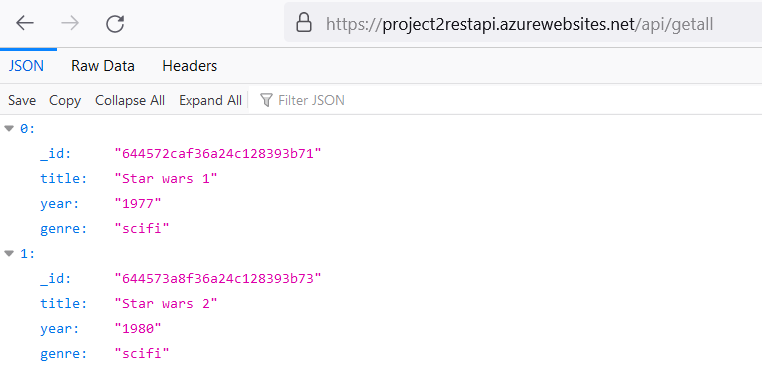
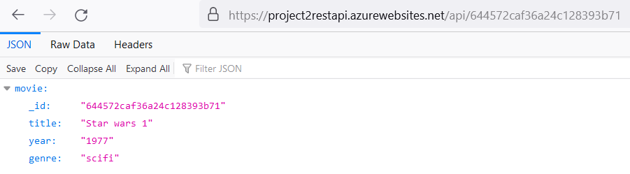

# Project 2: REST / API
Can be found and used at https://project1guestbook.azurewebsites.net/.

## Purpose of the project
Create a REST API for movie database in mongodb cloud services.

## How to use application
User can do below actions for example via Postman.

GET - Return all documents in collection: http://myapp.com/api/getall

GET - Return one item with the given id: http://myapp.com/api/:id 

POST - Create a new document in the collection: http://myapp.com/api/add 

PUT - Update the document with the given id: http://myapp.com/api/update/:id 

DELETE - Delete the item with the given id: http://myapp.com/api/delete/:id

## Status of the project
Ready to use.

## Pictures

